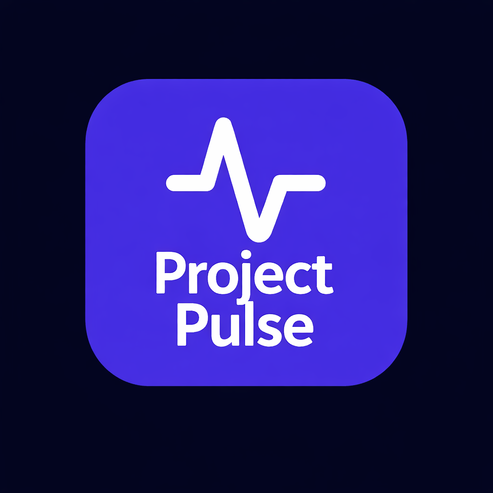
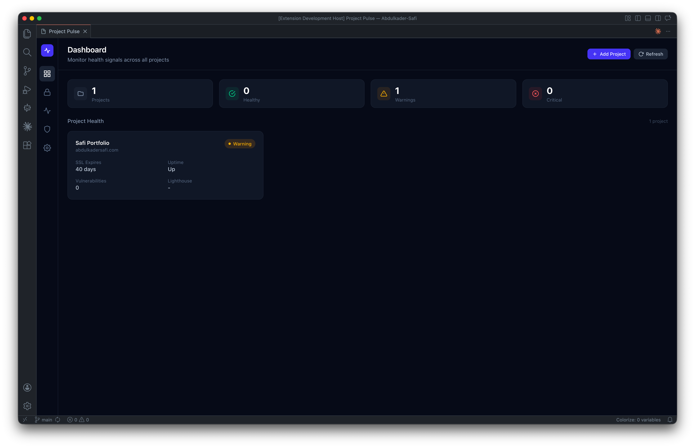
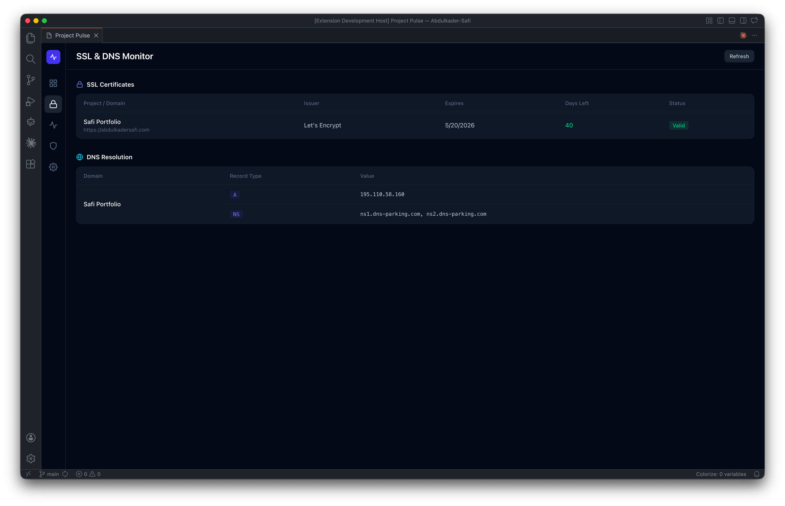
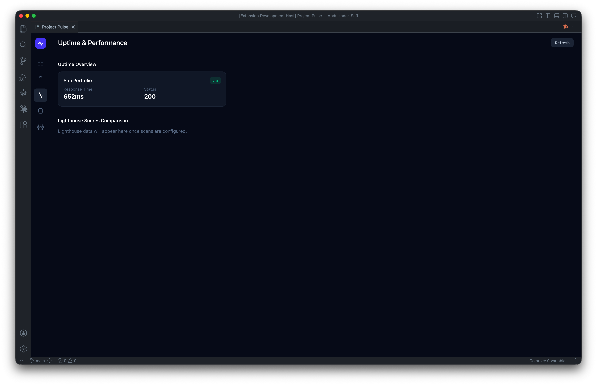
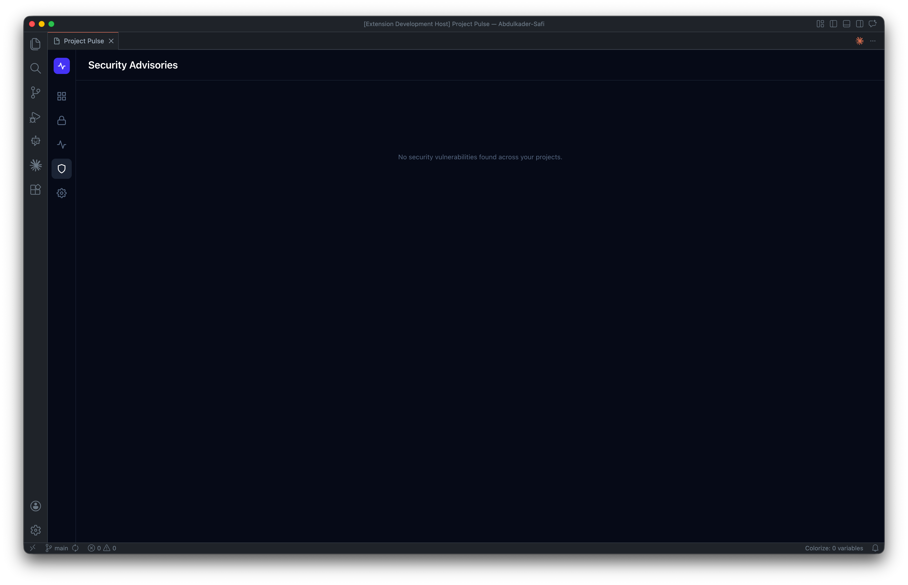
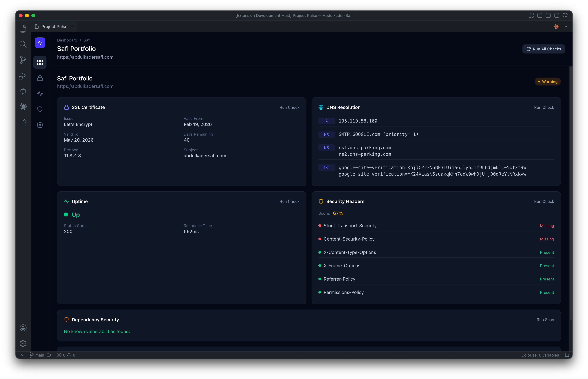

<p align="center">
  
</p>

# Project Pulse - VS Code Extension

> Monitor health signals across all your client projects without leaving your editor.



---

## Features

Project Pulse provides a unified dashboard for monitoring the health of multiple web projects. Add a website URL, and the extension continuously monitors SSL certificates, DNS resolution, uptime, dependency security, Lighthouse performance, and HTTP security headers — surfacing issues before they become client-facing problems.

### SSL Certificate Monitoring

Track certificate expiry, issuer, validity chain, and get alerts before certificates lapse.



### DNS Resolution Checks

Monitor DNS propagation across multiple servers (Google, Cloudflare, OpenDNS, Quad9) and detect record changes.

### Uptime Monitoring

Ping endpoints at configurable intervals and track response times, status codes, and downtime.



### Dependency Security Audit

Scan project dependencies for known vulnerabilities using `npm audit` or the OSV.dev API.



### Lighthouse Performance Scans

Run Lighthouse audits via the Google PageSpeed Insights API and track performance, accessibility, best practices, and SEO scores.

### HTTP Security Headers Check

Analyze response headers for security best practices (HSTS, CSP, X-Content-Type-Options, X-Frame-Options, Referrer-Policy, Permissions-Policy).

### Project Detail View

Drill into any project to see all monitoring data at a glance with per-check run controls.



### Settings & Alerts

Configure monitoring thresholds, notification preferences, and manage monitored projects. Alerts fire as VS Code notifications for critical issues.


---

## Getting Started

### Prerequisites

- Node.js (v18+) and npm
- VS Code (v1.106.1+)
- (Optional) Google PageSpeed Insights API key for Lighthouse scans

### Installation

1. Clone the repository:

   ```bash
   git clone https://github.com/Abdulkader-Safi/vscode-extensions-project-pulse.git
   cd ProjectPulse
   ```

2. Install dependencies:

   ```bash
   npm install
   ```

3. Build the extension:

   ```bash
   npm run compile
   ```

### Running

1. Press **F5** in VS Code to launch the Extension Development Host
2. Open the Command Palette (`Cmd+Shift+P` / `Ctrl+Shift+P`)
3. Run: **Project Pulse: Open Dashboard**

### Development

Watch mode for live rebuilds:

```bash
npm run watch
```

---

## Extension Settings

Configure thresholds and preferences in VS Code settings (`projectPulse.*`):

| Setting                                 | Default            | Description                                |
| --------------------------------------- | ------------------ | ------------------------------------------ |
| `projectPulse.lighthouseApiKey`         | `""`               | Google PageSpeed Insights API key          |
| `projectPulse.checkInterval`            | `15`               | Default check interval (minutes)           |
| `projectPulse.sslWarningDays`           | `30`               | SSL expiry warning threshold (days)        |
| `projectPulse.sslCriticalDays`          | `7`                | SSL expiry critical threshold (days)       |
| `projectPulse.uptimeWarningThreshold`   | `99.5`             | Uptime warning threshold (%)               |
| `projectPulse.lighthouseAlertThreshold` | `80`               | Lighthouse score alert threshold           |
| `projectPulse.checks.ssl`               | `true`             | Enable SSL monitoring                      |
| `projectPulse.checks.dns`               | `true`             | Enable DNS checks                          |
| `projectPulse.checks.uptime`            | `true`             | Enable uptime monitoring                   |
| `projectPulse.checks.security`          | `true`             | Enable security audits                     |
| `projectPulse.checks.lighthouse`        | `false`            | Enable Lighthouse scans (requires API key) |
| `projectPulse.checks.headers`           | `true`             | Enable security headers check              |
| `projectPulse.dataDirectory`            | `~/.project-pulse` | Historical data storage path               |

---

## Technology Stack

- **React 19** - Webview UI
- **Tailwind CSS v4** - Styling
- **TypeScript** - Type safety
- **esbuild** - Fast bundling
- **Node.js built-in modules** - SSL (`tls`), DNS (`dns`), HTTP (`https`) checks
- **Google PageSpeed Insights API** - Lighthouse scans
- **OSV.dev API** - Vulnerability scanning

## Build Scripts

| Script                | Description                             |
| --------------------- | --------------------------------------- |
| `npm run compile`     | Full build (type check + lint + bundle) |
| `npm run watch`       | Watch mode for development              |
| `npm run check-types` | TypeScript type checking                |
| `npm run lint`        | ESLint                                  |
| `npm run package`     | Production build                        |

---

## License

MIT
